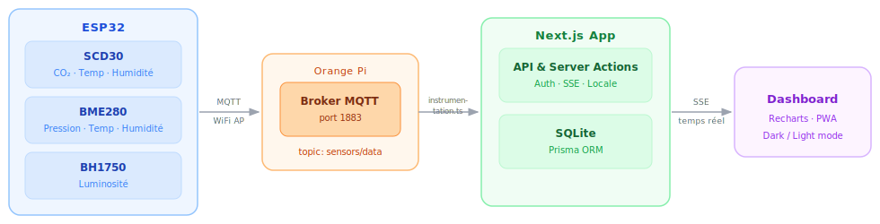

# Aurora Home

**Système de surveillance environnementale connecté**

Capteurs IoT · Dashboard temps réel · Firmware ESP32 · Authentification OTP

 

---

## Vue d'ensemble

Aurora Home est un système embarqué de surveillance environnementale. Un ESP32 collecte en continu des données de capteurs (CO₂, température, humidité, pression, luminosité) et les publie via MQTT. Une application Next.js reçoit ces données, les stocke et les affiche dans un dashboard en temps réel via Server-Sent Events.

---

## Dépôts

### [`aurora-home-app`](https://github.com/ESP-AuroraHome/aurora-home-app)
Application web complète — dashboard capteurs, graphiques interactifs, authentification OTP sans mot de passe, profil utilisateur, support PWA.

> Next.js 15 · Prisma · SQLite · Better Auth · Recharts · Tailwind CSS v4

---

### [`aurora-home-esp32`](https://github.com/ESP-AuroraHome/aurora-home-esp32)
Firmware ESP32 — initialisation des capteurs I²C, lecture périodique, fusion des données, publication MQTT en JSON.

> C++ · PlatformIO · Arduino framework · ArduinoJson · PubSubClient

---

### [`aurora-home-documentation`](https://github.com/ESP-AuroraHome/aurora-home-documentation)
Documentation complète du projet — guide utilisateur, référence technique, API, conventions de code et guide de contribution.

> Next.js 15 · Tailwind CSS v4 · Déployé en statique

---

### [`aurora-home-marketing`](https://github.com/ESP-AuroraHome/aurora-home-marketing)
Site vitrine et boutique en ligne du produit Aurora One — visionneuse 3D interactive avec réalité augmentée, tunnel d'achat Stripe, backoffice de gestion des commandes et des stocks.

> Nuxt 4 · TypeScript · Tailwind CSS v4 · SQLite · Stripe · Three.js

---

## Contribuer

Les contributions sont les bienvenues sur chacun des dépôts indépendamment.
Consulter le [guide de contribution](https://aurora-home-documentation.vercel.app/docs/contribution) pour le workflow complet (fork → branch → PR).

---

Epitech Rennes · Promo 2026

